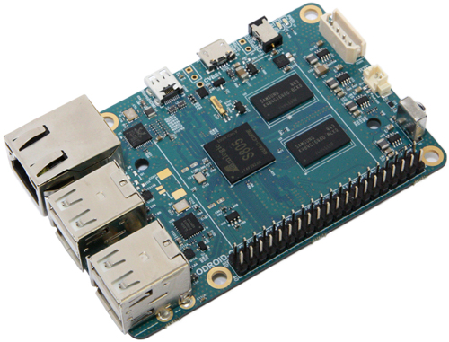

# ODROID-C1

This is the base Nerves System configuration for the Hardkernel ODROID-C1

 [Image credit](#hardkernel)

| Feature              | Description                     |
| -------------------- | ------------------------------- |
| CPU                  | 1.5 GHz quad-core ARMv7         |
| Memory               | 1 GB DRAM                       |
| Storage              | MicroSD or eMMC                 |
| Linux kernel         | 3.10 w/ Hardkernel patches      |
| IEx terminal         | HDMI and USB keyboard (can be changed to UART)   |
| GPIO, I2C, SPI       | Yes - Elixir ALE                |
| ADC                  | Untested                        |
| PWM                  | Yes, but no Elixir support      |
| UART                 | 1 available - ttyS0             |
| Gigabit Ethernet     | Yes                             |
| IR receiver          | Unknown                         |

## Installation

If [available in Hex](https://hex.pm/docs/publish), the package can be installed as:

  1. Add nerves_system_odroidc1 to your list of dependencies in `mix.exs`:

        def deps do
          [{:nerves_system_odroidc1, "~> 0.1.0"}]
        end

  2. Ensure nerves_system_odroidc1 is started before your application:

        def application do
          [applications: [:nerves_system_odroidc1]]
        end

[Image credit](#hardkernel): This image is from the [Hardkernel](http://www.hardkernel.com) website.
